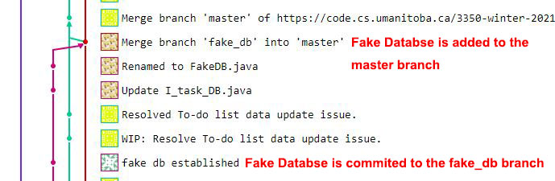

#  Group 11 Vision Statement  

Student Life will be used to assist students manage their time by taking the thought out of deciding how to schedule their day. Like a personal assistant, Student Life will keep track of what tasks need to be done and automatically create a schedule for the user. 

The core of Student Life will be its ability to estimate how long a given task will take to complete. For example, if the user enters reading 20 pages of their textbook as one of their tasks, the application could estimate that it would take approximately 20 minutes to complete. Due to the complexity of such a system, this will be implemented in an iterative manner. For the first iteration it will have very limited cases where it can be used, and it will use a simple algorithm to estimate the time to complete a task. Over the course of the term this feature will be developed to become more generalized (can be used for more types of tasks) and more accurate by taking into account previous user data for similar tasks. 

This system will then be used in conjunction with a calendar system to make estimations for the user inputted tasks and automatically populate their calendar so that they have a detailed schedule for their day. This will allow users to simply follow their schedule and not have to waste any time on deciding how they should spend their time.

In order for this system to function optimally, it will need a way of knowing whether or not the predictions were accurate or if it should adjust for next time. To gather this data in a way that is not time consuming for the user, when a task is scheduled to be completed, the user will be asked if they have completed their task. When prompted they can either respond that they have completed their task with the time provided, or they can ask for more time which will be interpreted as a failure to make an accurate time estimation. This should not be very easy for the user to do since it is taking time away from their work. 

The primary intended users for this app are post-secondary students. This app specifically targets them because when making the change from secondary school to post-secondary, a great challenge students must overcome is learning how to manage their time effectively. This is in contrast to secondary school where students are given time to work during class, and the workload is far smaller. Therefore, post-secondary students would benefit from an app that would lessen the shock experienced from the increased workload and lack of in class study time. 

Not only would it benefit new students, it would also benefit those who are already in the later part of their degree. It is not a simple task to stay organized and having an application to do some of the work would be invaluable for students who are already busy enough as it is. 

This application will be considered a success if students can rely on this system to keep their schedule organized. This will be determined by examining the accuracy of the time estimations and the amount of friction this application causes on their current workflow. 

# Adding a Feature

Feature: To-do list

This feature was developed over the course of the entire time we spent on this iteration. We started by creating a database object and a task domain specific object to pass around the layers. Then we wrote the code for the UI layers and the logic layer. Both of these steps were created in their own branches called DatabaseSystem and Todo\_list\_UI respectively. Once these were implemented we substituted the real database for a fake one. Afterwards we wrote some additional unit tests to iron out any remaining bugs. Each of these branches were merged to master as they were being completed via merge requests and another group member approving the merge request. Once all our tests passed and everything was merged to the master branch, we considered the feature complete. 

Links:

- [Merge Request #1](https://code.cs.umanitoba.ca/3350-winter-2021-a01/your-internet-neighbours-group-11/-/merge_requests/3)
- [Merge Request #2](https://code.cs.umanitoba.ca/3350-winter-2021-a01/your-internet-neighbours-group-11/-/merge_requests/19)
- [Merge Request #3](https://code.cs.umanitoba.ca/3350-winter-2021-a01/your-internet-neighbours-group-11/-/merge_requests/20)
- [Merge Request #4](https://code.cs.umanitoba.ca/3350-winter-2021-a01/your-internet-neighbours-group-11/-/merge_requests/22)
- [Merge Request #5](https://code.cs.umanitoba.ca/3350-winter-2021-a01/your-internet-neighbours-group-11/-/merge_requests/29)
- [Feature](https://code.cs.umanitoba.ca/3350-winter-2021-a01/your-internet-neighbours-group-11/-/issues/5)
- [User Story #1](https://code.cs.umanitoba.ca/3350-winter-2021-a01/your-internet-neighbours-group-11/-/issues/20)
- [User Story #2](https://code.cs.umanitoba.ca/3350-winter-2021-a01/your-internet-neighbours-group-11/-/issues/4)
- [User Story #3](https://code.cs.umanitoba.ca/3350-winter-2021-a01/your-internet-neighbours-group-11/-/issues/2)
- [Tests](https://code.cs.umanitoba.ca/3350-winter-2021-a01/your-internet-neighbours-group-11/-/blob/master/app/src/test/java/com/groupeleven/studentlife/logicTests/TodoLogicLayerUnitTests.java)
- Merge Commits can be found on the associated merge request pages

# Exceptional code
[Exception Code Test File](app/src/test/java/com/groupeleven/studentlife/databaseTests/FakeDBUnitTests.java)   

FakeDBUnitTests.java : public void exceptionTest();  

If the database is empty, it will throw an exception when the getData() is called. This will ensure the callers are aware of the empty database and deal with the empty database explicitly. The callers for the FakeDatabse.getData() will be the logic units, we want to ensure the logic units handle the empty database situation safely.   

# Branching Strategy

This repository deploys Github Flow branching strategy.

Two Branches will be kept throughout the project:
* master: the main branch, protected from pushing
* backup: an extra protection for the main branch, protected from pushing    

The master branch will be merged to the backup branch from time to time.

## Commit
* Before committing, developers should pull from the master branch to make sure their local repository is up to date.
* Developers needs to commit to a new branch (or his/her current working branch if a new branch is created before).

## Push and Merge
* Developers can only push to their current working branch.  
* After the work is pushed to the current working branch, developers can create a merge request.  
* Upon a merge request is created, group members will review the codes and approve the merge request.
* After merging, the current working branch can be kept for further commitments or can be deleted.  

## Example Of Adding Feature

     

# SOLID  
[link to group12's issue](https://code.cs.umanitoba.ca/3350-winter-2021-a01/fitnics-group-12/-/issues/23)   

#  Agile Planning  
Time estimator is one of our most important features and we tried to implement it first. However, as we progressed we found out that there were other features that were higher priority, so we decided push the time estimator to iteration 2. We didn't change the description
of any features or user stories.
[link to time estimator](https://code.cs.umanitoba.ca/3350-winter-2021-a01/your-internet-neighbours-group-11/-/issues/1)   
[link to user story](https://code.cs.umanitoba.ca/3350-winter-2021-a01/your-internet-neighbours-group-11/-/issues/3)   

#  ARCHITECTURE

[Application Architecture](Architecture.md)   

