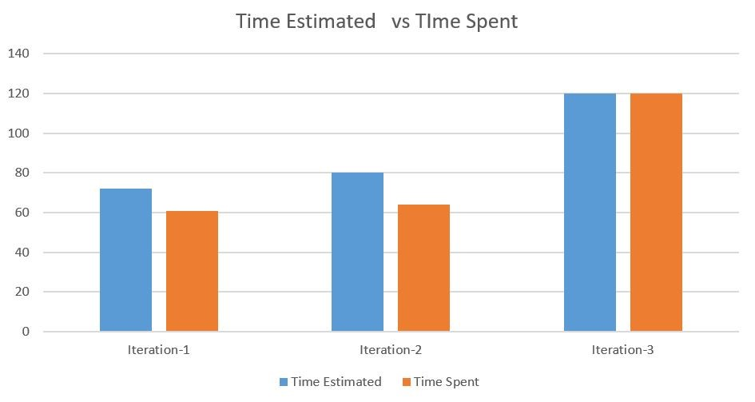

# What technical debt has been cleaned up
## Deliberate and Prudent Technichal Debt

In iteration 2 we have a feature which is to recommend websites for users and users can also add their favourite website.

However, we ended up with only recommended websites and no inserting function for users.

In iteration 3, we decide that recommended websites is enough to support our system and concept, so we removed all function and element related to the customization of websites.

It is deliberate and prudent because we don't have enough time to build the whole system and what we can only do is to cut it and pick up the most valuable part.

[Useless code removed](https://code.cs.umanitoba.ca/3350-winter-2021-a01/your-internet-neighbours-group-11/-/commit/b0ac02a21af2fa1f19816633c6a3b9a29fe30248)

# What technical debt did you leave?
## Deliberate and Prudent Technical Debt

A new feature we added in iteration 3 is the notifiication, and the notification is supposed to be a separate activity with a logic unit to get data from database.

However, due to the limited time, we decide to put the function inside another class and using data from that class rather than get it by a logic unit.

It is deliberate and prudent because we do not have enough time to build a whole system for it (an activity, a receiver, a set-up class, a logic unit, an unit test for the logic unit). We choose to make it work for now and deal with the consequences in iteration 4, if we have one.

[Notification code added in Toupdata.class - L195 -](https://code.cs.umanitoba.ca/3350-winter-2021-a01/your-internet-neighbours-group-11/-/commit/65e986a5db342be864a72fb15f3061e6928c40a9)

# Discuss a Feature or User Story that was cut/re-prioritized
We found a bug in iteration 2 and moved the edit/delete task feature to iteration 3. We did however keep the interactive calendar as a feature in the current iteration. We did this by breaking up a feature into individual ones and kept them for the next iteration, and made sure we did not pivot from the original goal.
# Acceptance test/end-to-end

One of the acceptance tests is the to-do list acceptance test.  This test tests the interactions between user and the to-do list interface. These interactions include adding task to the list, editing the already existent task, and deleting task from the list. These tests are written base on the user stores. To ensure the test is not flaky, the database will be clean up during each sub-test. Also, the sub-tests are enforced to run in an order that matches the user scenarios.

[Link to the test]( https://code.cs.umanitoba.ca/3350-winter-2021-a01/your-internet-neighbours-group-11/-/blob/master/app/src/androidTest/java/com/groupeleven/studentlife/acceptanceTests/TodoListAcceptanceTests.java)  
[User stores relate to the test – issue#2]( https://code.cs.umanitoba.ca/3350-winter-2021-a01/your-internet-neighbours-group-11/-/issues/2)  
[User stores relate to the test– issue#20]( https://code.cs.umanitoba.ca/3350-winter-2021-a01/your-internet-neighbours-group-11/-/issues/20)  
[User stores relate to the test– issue#19]( https://code.cs.umanitoba.ca/3350-winter-2021-a01/your-internet-neighbours-group-11/-/issues/19)  

# Acceptance test, untestable  

Writing acceptance test by using Espresso is straight forward but also tedious. Testing a specific RecyclerView entry is challenging. The outdates information provided by the API added another difficulty to target the specific RecyclerView entry. It is worth to mention that finding the resources ID for the UI elements is painful if the ID are not named systematically.  What’s more, the push notification is untestable by Espresso.  

# Velocity/teamwork

For the first iteration, we could not meet up with the Estimated time. There are six people in our group, every one of us decided to spend 5 hours a week on the project. So, we were able to commit 60 hours of work in two weeks. For iteration two, we had three weeks in hand. Considering the previous iteration, we thought for three weeks might be able to contribute 80 hours of work for the project as a team. But to release a deliverable application we had to move a few features to the next iteration and for the leftover features, it took a bit less time than the estimated time. For iteration three, we decided to put our best to meet our visions and to provide a clean application. For this iteration, there were a few tasks where it took less time than the estimated time and vice versa. But at the end of the project, it took the same amount of time we estimated for the iteration.

[Velocity.xlsx](Velocity.xlsx)
